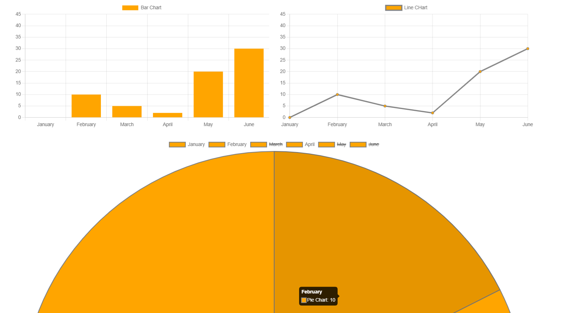

# Getting Started with Create React App

The goal of this  project is showing how use chart.js In React :))

### Install this dependency

npm install chart.js react-chartjs-2

You will get Something like {Down}

// tabeles

        const columns = useMemo(
            () => [
            {
                accessorKey: "name", //simple recommended way to define a column
                header: "Name",
                muiTableHeadCellProps: { sx: { color: "green" } }, //custom props
                Cell: ({ renderedCellValue }) => <strong>{renderedCellValue}</strong> //optional custom cell render
            },
            {
                accessorFn: (row) => row.age, //alternate way
                id: "age", //id required if you use accessorFn instead of accessorKey
                header: "Age",
                Header: <i style={{ color: "red" }}>Age</i> //optional custom markup
            },
            ],
            []
        );

        

Developed By Piko dev => HAMZA BRAIMI 

<!--Mastering Stock Trading Charts with React JS | Step-by-Step ... -->